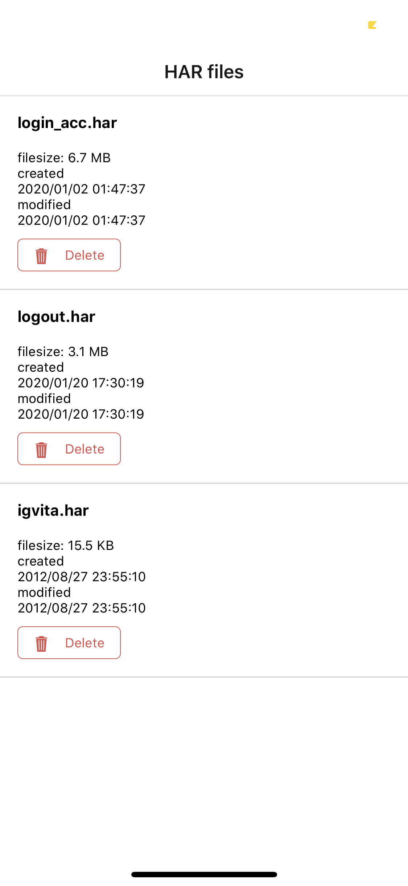
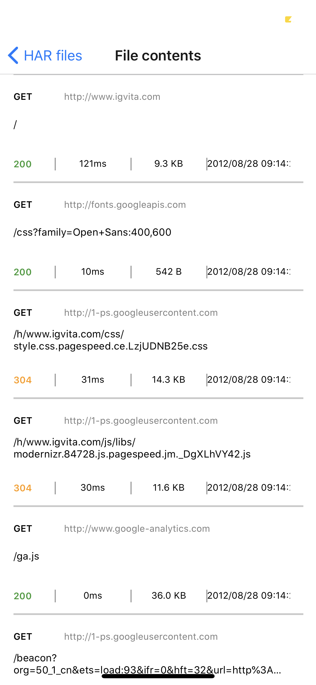
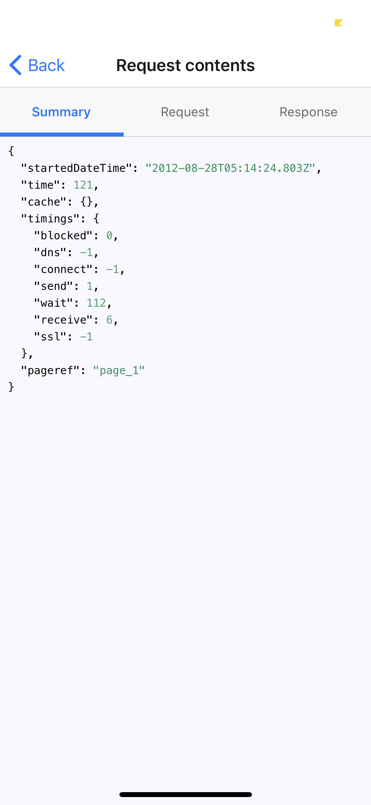
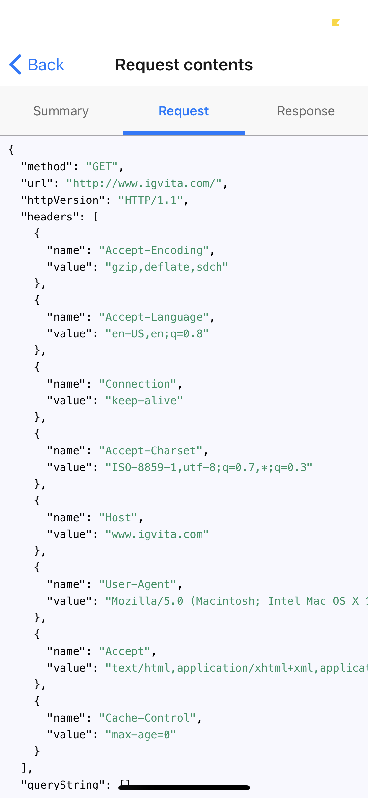
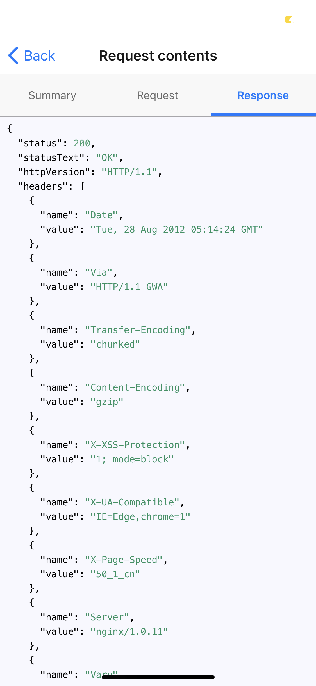

# HarViewer - Mobile

### 1 Problem
At my work we use HAR files to save context to troubleshoot issues. HAR (HTTPArchive) files are json files with all requests and responses like tcpdump, there are a lot of cool apps for desktop like Charles Proxy or Fiddler Proxy.
But sometimes you need to investigate such files from mobile/tablet. So, it is main purpose of this app - to preview HAR files.

### 2 Libraries
* react-native
* native-base
* react-navigation
* react-syntax-highlighter

### 3 Features
* Android and ios versions
* Possibility to send .har files from other apps (slack/mail/...) to HarViewer
* Possibility to delete files from own folder
* List of files from own folder
* Possibility to open files from own folder
* Detailed view of requests and responses

### 4 Screens

